Guia do participante

[Gestão do Projeto](#gestao)
[Ferramentas do Time](#ferramentas)
[Jornada do Final de Semana](#jornada)
[Critérios de Julgamento](#julgamento)

Gestão do Projeto
-----------------

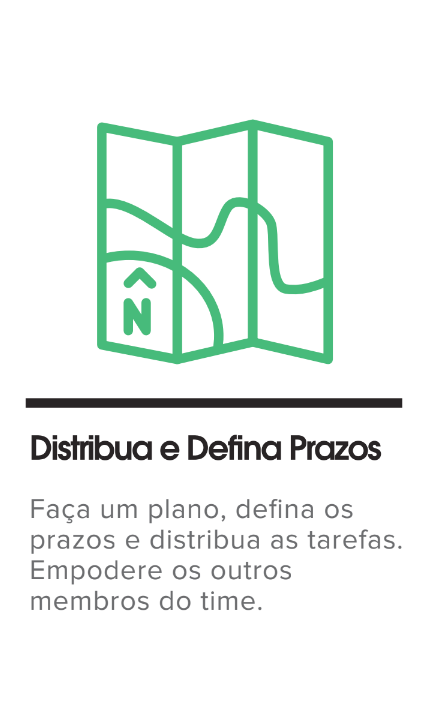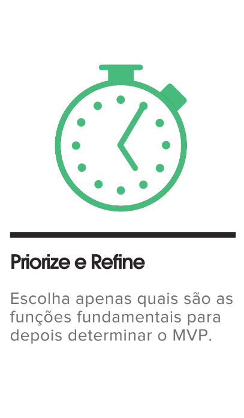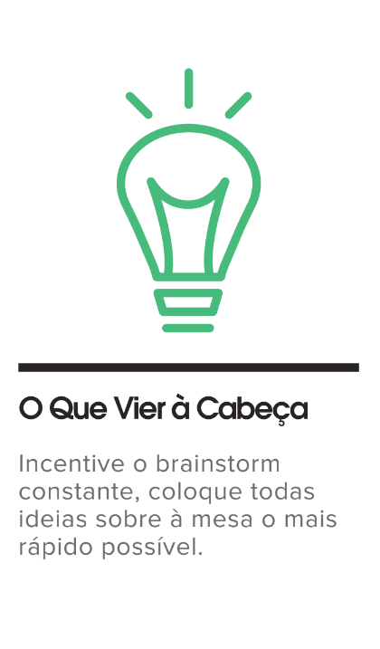

Ferramentas do Time
-------------------

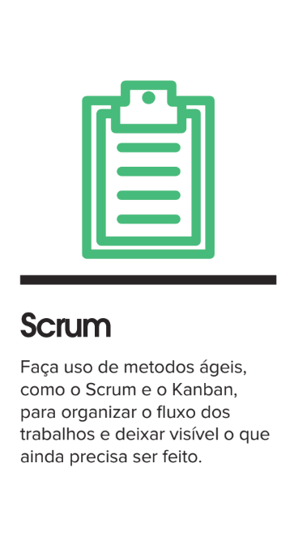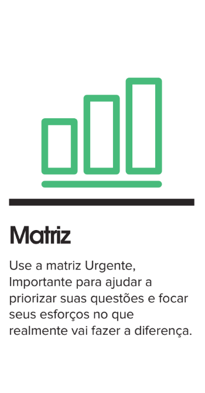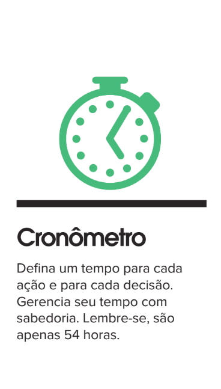

Jornada do Final de Semana
--------------------------

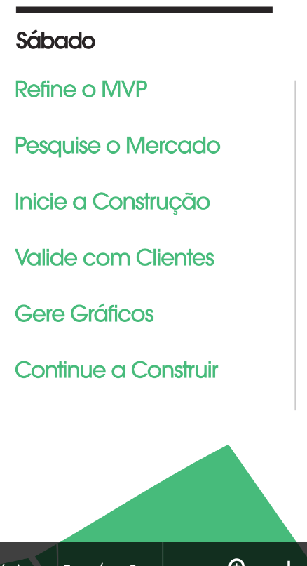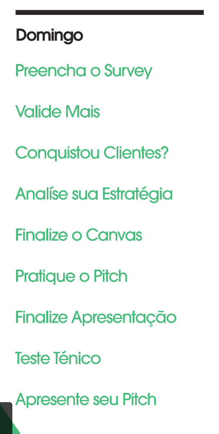

Critérios de Julgamento
-----------------------

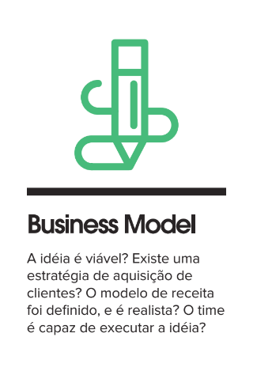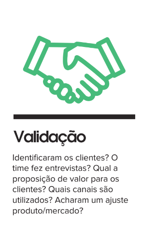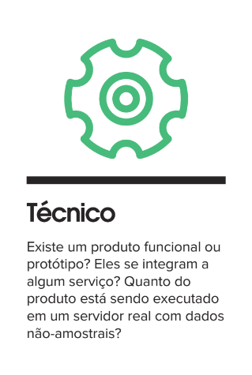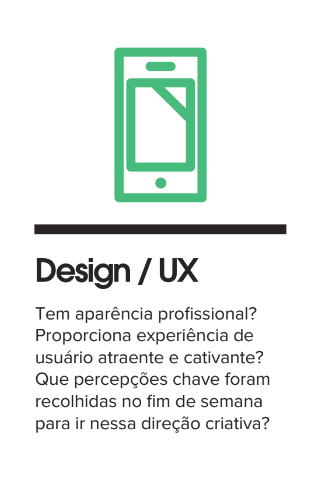

Técnico (Execução) e Design contam como apenas um critério.